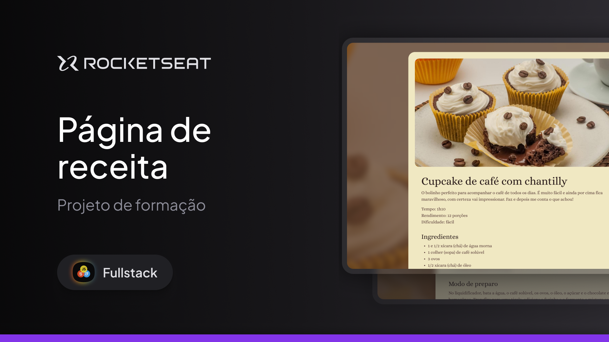

<div align="center">

# 🧁 Página de Receita - Cupcake

<p align="center">


</p>

Uma página de receita estática desenvolvida como parte da formação **Fullstack** da Rocketseat.



</div>

---

## 📖 Sobre o projeto

Este projeto consiste em uma página de receita estática para um cupcake de café com chantilly.

O principal objetivo foi revisar e reforçar conceitos fundamentais de **HTML5** e **CSS3**, como estruturação semântica, organização de conteúdo e estilização de páginas.

Embora seja um projeto simples, ele representa uma etapa importante na consolidação da base para projetos mais complexos.

---

## 🚀 Demonstração

🔗 **Deploy:** https://vbuarque.github.io/RS-Pagina-Receita-HTML/

---

## 💻 Tecnologias utilizadas

- HTML5
- CSS3

---

## 📚 Conceitos praticados

Durante o desenvolvimento foram revisados conceitos como:

- Estrutura semântica em HTML
- Organização de arquivos
- Seletores CSS
- Box Model
- Tipografia
- Espaçamentos (margin e padding)
- Estilização de imagens
- Hierarquia de títulos
- Boas práticas de organização do código

---

## 📂 Estrutura do projeto

```text
📦 RS-Pagina-Receita-HTML
├── assets/
│   ├── images/
├── index.html
├── style.css
└── README.md
```

> A estrutura pode variar conforme a organização dos arquivos.

---

## ⚙️ Como executar

Clone o repositório:

```bash
git clone https://github.com/vbuarque/RS-Pagina-Receita-HTML.git
```

Entre na pasta:

```bash
cd RS-Pagina-Receita-HTML
```

Abra o arquivo `index.html` no navegador de sua preferência.

---

## 🎯 Objetivo

Este projeto foi desenvolvido como exercício de revisão dos fundamentos de HTML e CSS antes de avançar para projetos mais complexos durante minha jornada de estudos em desenvolvimento Front-end.

---

## 📌 Melhorias futuras

- [ ] Tornar a página responsiva
- [ ] Melhorar a acessibilidade
- [ ] Adicionar animações em CSS
- [ ] Utilizar variáveis CSS
- [ ] Publicar uma versão otimizada

---

## 👨‍💻 Autor

Desenvolvido por **Vinícius Buarque**.

- GitHub: [@vbuarque](https://github.com/vbuarque)

---

## 📄 Licença

Este projeto está sob a licença MIT. Consulte o arquivo `LICENSE` para mais informações.

---

<p align="center">
Feito com ❤️ durante os estudos da formação Fullstack da Rocketseat.
</p>